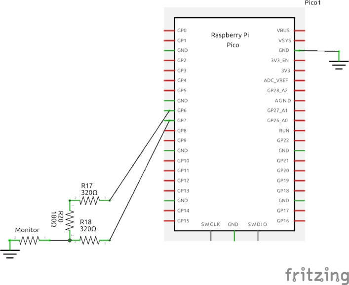

# Lissajous
Lissajous Pattern, for the Raspberry Pi Pico, with Composite Video output using an R2R resistor DAC.  Resolution 640x480

A modified version of [Life](https://github.com/obstruse/life) / [pico-composite8](https://github.com/obstruse/pico-composite8) / [pico-mposite](https://github.com/breakintoprogram/pico-mposite).

#### 8-Bit R2R Resistor DAC
__*Uses the same DAC as pico-composite8, but only the top two bits are required*__

The input impedance of the Composite Monitor is 75Ω; the output impedance of the R2R ladder is R.  In order to get 1V across a 75Ω load with a 3.3V source, R needs to be 2.3 * 75 = 172.5Ω.  Closest 'standard' values are 180Ω/360Ω.  
Unfortunately using those values doesn't work for 8-bits.  The values are low enough that the internal resistance on the Pico GPIO pins becomes important, and causes visible errors on the 7- and 8-bit.  Measuring the voltage drop on the pins gives a calculated series resistance of about 40Ω, so you will need to reduce the 2R value by that much to compensate.  I used two 160Ω resistors in series.

On the other hand, since this only uses 2 bits, it doesn't really matter.

The R2R DAC will draw about 19mA total from the Pico when all the bits are '1', with a maximum of 6.5mA on any single pin.  Here's the simulation: [R2R DAC Simulation](https://tinyurl.com/yyc6fewc)

#### Modifying Patterns
Vary the parameters within _second_core()_ to change the pattern

	float x = 0.0;                          // phase
	float y = PI / 2.0;                     // phase
	float xIncr = 2.0 * PI / 640.0;         // frequency
	float yIncr = 2.0 * PI / 650.0;         // frequency
	int persistence = 3200;                 // persistence
	int speed = 512;                        // speed

#### the BUG
On some program starts, the Vertical Interlace is 'out of phase' with the monitor - the interlace lines offset in the wrong directions.  Plugging/un-plugging the video cable several times clears it up.  Don't know why it does that.

Any ideas, let me know...

